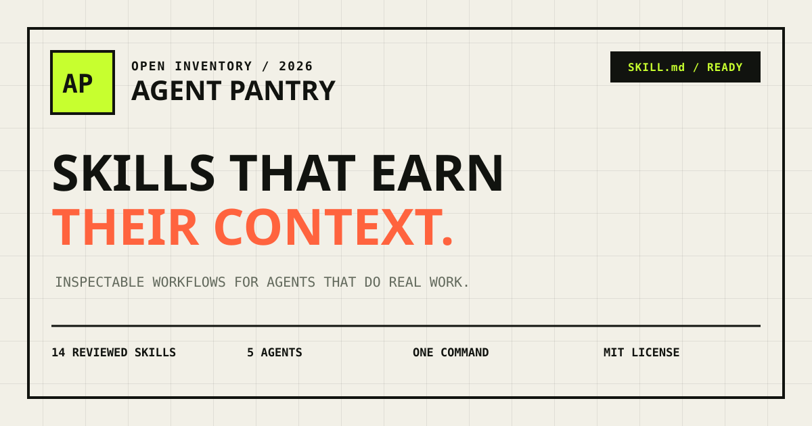

<p align="center">
  
</p>

<p align="center">
  <strong>Human-reviewed workflows for coding agents.</strong><br />
  Inspect the method. Install the folder. Get repeatable work instead of another lucky prompt.
</p>

<p align="center">
  <a href="https://HaoXuanAce.github.io/agent-pantry/">Live catalog</a> ·
  <a href="#quick-start">Quick start</a> ·
  <a href="README.md">简体中文</a> ·
  <a href="GITHUB_PUBLISH_GUIDE.md">Publish guide</a> ·
  <a href="CONTRIBUTING.md">Contribute</a>
</p>

<p align="center">
  <a href="https://github.com/HaoXuanAce/agent-pantry/actions/workflows/ci.yml"></a>
  <a href="https://github.com/HaoXuanAce/agent-pantry/stargazers"></a>
  
  
  
</p>

## Why Agent Pantry?

Most skill collections optimize for the biggest number in the README. Agent Pantry optimizes for whether a Skill changes how an agent works—and whether a human can inspect the method.

Every skill in this repository has:

- a precise trigger and explicit non-goals;
- a step-by-step workflow grounded in evidence;
- stop conditions for unsafe or ambiguous work;
- a reviewable output contract;
- at least four structured evaluation scenarios with explicit expectations;
- no runtime dependency, account, API key, or telemetry.

The result is deliberately focused: **14 Skills you can read and review**, not 800 prompts you cannot inspect. `reviewed` means the instructions and eval definitions passed repository checks; it does not claim a model benchmark score.

## Quick start

Install from GitHub with the open Skills CLI:

```bash
npx skills add HaoXuanAce/agent-pantry
```

Install one specific skill:

```bash
npx skills add HaoXuanAce/agent-pantry --skill bug-triage
```

Or copy a plain folder into your agent's project skill directory:

```bash
cp -R skills/bug-triage .agents/skills/bug-triage
```

The repository also contains a dedicated zero-account CLI package. After publishing it to npm, it provides inspection, search, verification, and explicit target selection:

```bash
npx agent-pantry inspect bug-triage
npx agent-pantry add bug-triage --agent codex
```

The CLI copies plain files. There is no background service and nothing runs when a skill is installed.

## Try one in 60 seconds

After installing `vibe-to-verified`, give your coding agent a real generated patch and ask:

```text
Use vibe-to-verified on the current diff. Do not trust the generator summary.
Inventory unexpected scope, assign the highest risk lane, build an evidence ledger,
challenge one failure path, and return MERGE, REVISE, or STOP.
```

The Skill should produce a decision tied to observed evidence—not another prose review. See the [copy-ready recipes](examples/README.md) for skill auditing, production incident investigation, and zero-downtime migration planning.

## The pantry

| Skill | Job | What it produces |
| --- | --- | --- |
| [`vibe-to-verified`](skills/vibe-to-verified) | Verify AI-generated code | Risk map, evidence ledger, merge decision |
| [`skill-supply-chain-auditor`](skills/skill-supply-chain-auditor) | Audit a Skill before installation | Capability inventory, risks, install decision |
| [`repo-xray`](skills/repo-xray) | Understand an unfamiliar repository | Architecture path, change surface, risk register |
| [`dependency-upgrade-surgeon`](skills/dependency-upgrade-surgeon) | Upgrade a dependency safely | Compatibility map, sequence, verification |
| [`zero-downtime-db-migration`](skills/zero-downtime-db-migration) | Change a live database schema | Migration phases, lock risks, recovery |
| [`bug-triage`](skills/bug-triage) | Diagnose a vague or flaky failure | Reproduction, causal chain, fix boundary |
| [`incident-response-investigator`](skills/incident-response-investigator) | Investigate production incidents | Timeline, hypothesis tree, containment decision |
| [`pull-request-reviewer`](skills/pull-request-reviewer) | Review a patch without style noise | Ranked findings, line evidence, merge verdict |
| [`security-first-review`](skills/security-first-review) | Audit a changed trust boundary | Exploit paths, evidence, minimal mitigations |
| [`api-contract-auditor`](skills/api-contract-auditor) | Detect compatibility breaks | Contract diff, consumer impact, migration path |
| [`test-gap-hunter`](skills/test-gap-hunter) | Find meaningful missing tests | Risk matrix and executable test specifications |
| [`frontend-reconstruction`](skills/frontend-reconstruction) | Rebuild a visual reference | Responsive UI, real states, visual QA notes |
| [`browser-acceptance-evidence`](skills/browser-acceptance-evidence) | Prove a browser journey | Journey results, screenshots, runtime evidence |
| [`release-readiness`](skills/release-readiness) | Decide whether a change can ship | GO/NO-GO decision, rollout and rollback |

## Curated packs

Install a coherent mission kit with the dedicated CLI:

```bash
npx agent-pantry pack list
npx agent-pantry pack add trust-ai-code --dry-run
```

| Pack | Included Skills |
| --- | --- |
| `trust-ai-code` | AI patch verification, PR review, test gaps, security review |
| `ship-without-surprises` | API contracts, DB migration, browser acceptance, release decision |
| `production-first-aid` | Repository map, bug triage, incident investigation |
| `safe-change-kit` | Dependency upgrades, frontend reconstruction, browser acceptance |

## Agent compatibility

Agent Pantry uses the open [`SKILL.md`](https://agentskills.io/) directory format.

| Agent | Project install path | Command value |
| --- | --- | --- |
| OpenAI Codex | `.agents/skills/` | `codex` |
| Claude Code | `.claude/skills/` | `claude` |
| Cursor | `.cursor/skills/` | `cursor` |
| Gemini CLI | `.gemini/skills/` | `gemini` |
| GitHub Copilot | `.github/skills/` | `copilot` |

You can also copy any folder from [`skills/`](skills) manually. The content stays portable because the workflow does not depend on a proprietary runtime.

## Dedicated CLI reference

```text
agent-pantry list [--phase <name>]
agent-pantry search <query>
agent-pantry inspect <skill>
agent-pantry add <skill> --agent <agent> [--global] [--force] [--dry-run]
agent-pantry diff <skill> --agent <agent> [--global]
agent-pantry remove <skill> --agent <agent> [--global] --yes
agent-pantry pack list
agent-pantry pack add <pack> --agent <agent> [--dry-run]
agent-pantry verify [skill]
agent-pantry doctor
```

`--force` replaces only the exact target skill directory. Existing installations are never overwritten by default.

## Anatomy of a skill

```text
skills/bug-triage/
├── SKILL.md
├── evals/
│   └── evals.json
└── scripts/       optional deterministic helpers
```

`SKILL.md` is the installable instruction set. `evals/evals.json` follows the Skill Creator schema and records prompts, expected outputs, input fixtures, and reviewable expectations. The current gate validates structure and consistency; model-level benchmark results will only be published when runs are reproducible and disclose model, date, raw outputs, and scoring.

Read the full [evaluation policy](docs/EVALUATION.md), including what `reviewed` does and does not mean.

## Local development

Requirements: Node.js 20.19+ and pnpm 10+.

```bash
pnpm install
pnpm dev
```

Run repository checks:

```bash
pnpm check
```

The monorepo contains:

```text
apps/web/       Vue catalog site
packages/cli/   zero-account installer CLI
skills/         portable Agent Skills
catalog.json    shared catalog metadata
packs.json      curated mission packs
```

## Principles

1. **Evidence before confidence.** Claims point to code, commands, or observed behavior.
2. **Stop conditions are features.** A useful workflow knows when autonomy should end.
3. **Outputs have a contract.** “Done” is explicit and reviewable.
4. **Small enough to inspect.** A human can understand the complete skill in minutes.

Read [CONTRIBUTING.md](CONTRIBUTING.md) before proposing a skill. New entries are accepted for quality and distinct value, not to grow the counter.

See the public [roadmap](ROADMAP.md) for the next engineering milestones and candidate workflows.

## Security

Skills are instructions with meaningful influence over an agent. Read a skill before installing it, review changes on update, and pin repository versions in controlled environments. See [SECURITY.md](SECURITY.md) for reporting and trust guidance.

## License

[MIT](LICENSE) for code and skill content.
